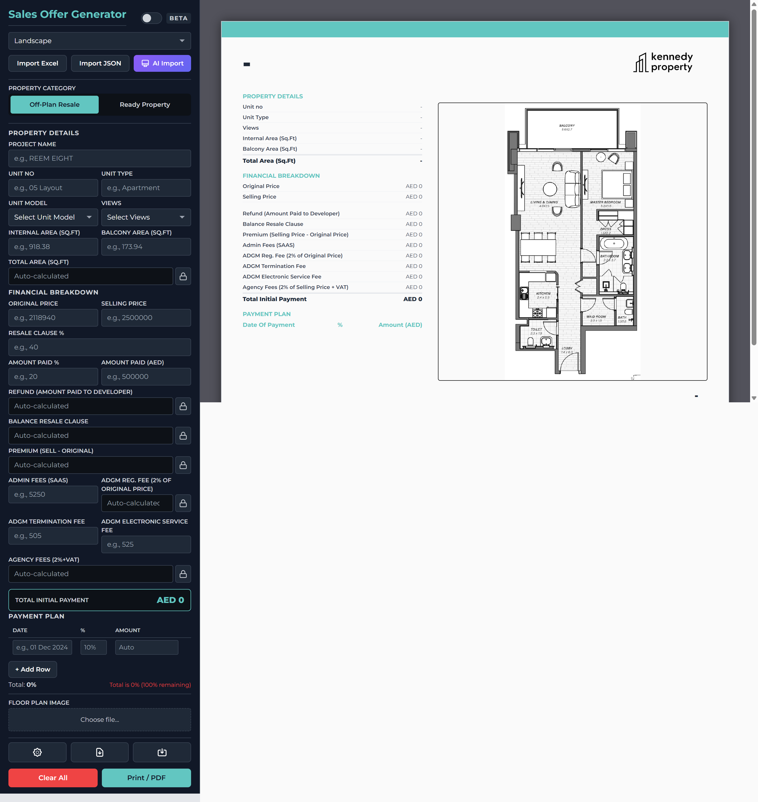
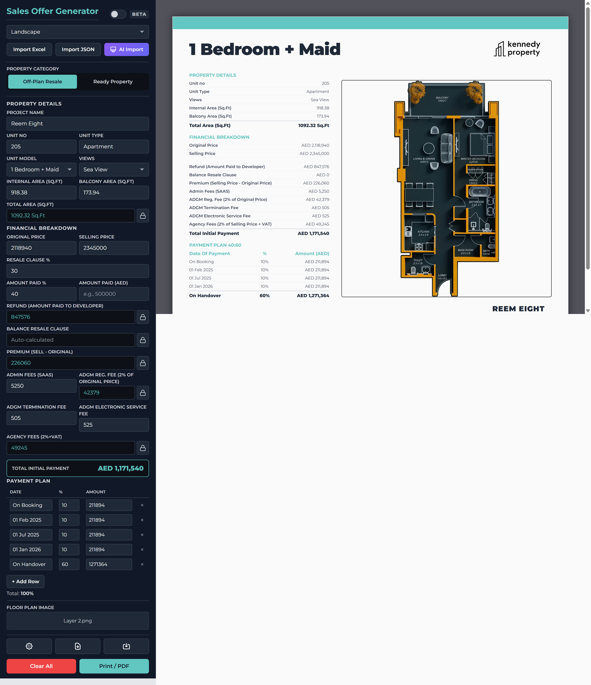

# Sales Offer Generator - User Manual

**Version 1.1.0** | Last Updated: December 2025

## Table of Contents

1. [Getting Started](#getting-started)
2. [Interface Overview](#interface-overview)
3. [Property Categories](#property-categories)
4. [Entering Property Details](#entering-property-details)
5. [Financial Breakdown](#financial-breakdown)
6. [Payment Plan Editor](#payment-plan-editor)
7. [Auto-Calculations](#auto-calculations)
8. [Importing Data](#importing-data)
9. [AI Document Import](#ai-document-import)
10. [Templates](#templates)
11. [Branding & Customization](#branding--customization)
12. [Exporting Documents](#exporting-documents)
13. [Saving & Loading Templates](#saving--loading-templates)
14. [Keyboard Shortcuts](#keyboard-shortcuts)
15. [For Developers](#for-developers)
16. [Troubleshooting](#troubleshooting)

---

## Getting Started

### Opening the App

1. **Option A - Direct Open**: Double-click `index.html` (limited functionality)
2. **Option B - Local Server** (Recommended):
   - Open PowerShell or Command Prompt in the `Sales Offer` folder
   - Run: `python -m http.server 8000`
   - Open browser to `http://localhost:8000`

### First Time Setup

1. Open the app in your browser
2. Click the **Settings** button (gear icon)
3. Configure your branding (logo, colors, company name)
4. If using AI features, add your Gemini API key
5. Click **Save Settings**

> **Security Note:** Your API key is stored locally in your browser with basic encoding. A warning is displayed in the AI Settings tab. For sensitive production use, consider a server-side proxy.

---

## Interface Overview

The app has two main areas:

```
┌─────────────────────────────────────────────────────────────┐
│  LEFT SIDEBAR              │  RIGHT PREVIEW AREA            │
│  (Input Controls)          │  (Live A4 Document)            │
│                            │                                │
│  • Template selector       │  ┌──────────────────────────┐  │
│  • Import buttons          │  │                          │  │
│  • Property details        │  │    Live Preview of       │  │
│  • Financial breakdown     │  │    Your Sales Offer      │  │
│  • Payment plan editor     │  │                          │  │
│  • Floor plan upload       │  │                          │  │
│  • Action buttons          │  └──────────────────────────┘  │
│                            │                                │
└─────────────────────────────────────────────────────────────┘
```



---

## Property Categories


The app supports two property categories with different calculation methods:

### Off-Plan Resale (Default)

For properties still under construction or before handover:
- Shows Resale Clause %, Amount Paid fields
- Calculates Refund, Balance, and Premium
- Displays Payment Plan table

### Ready Property

For completed properties:
- Shows Property Status section (Project Age, Unit Ownership)
- Supports Occupancy Status (Owner Occupied, Vacant, Leased)
- For leased properties: Current Rent, Lease Until, Rent Refund options
- Service Charge field
- Hides Payment Plan (not applicable)

### Switching Categories

1. Find the **Property Category** toggle at the top of the sidebar
2. Click **Off-Plan Resale** or **Ready Property**
3. The form and preview update automatically
4. Data for both categories is preserved when switching

---

## Entering Property Details

### Basic Information

| Field | Description | Example |
|-------|-------------|---------|
| **Project Name** | Development/project name | REEM EIGHT |
| **Unit No** | Unit identifier | 05 Layout |
| **Unit Type** | Property type | Apartment, Villa, Townhouse |
| **Unit Model** | Bedroom configuration | 1 Bedroom, 2 Bedroom + Maid |
| **Views** | View description | Mangrove Views, Sea View |
| **Internal Area** | Indoor area in sq ft | 918.38 |
| **Balcony Area** | Outdoor area in sq ft | 173.94 |
| **Total Area** | Auto-calculated | 1,092.32 Sq.Ft |

### Tips

- All fields update the preview in real-time
- Total Area is calculated automatically from Internal + Balcony
- Press Tab to move between fields quickly

---

## Financial Breakdown

### Input Fields

| Field | Description | Auto-Calculated? |
|-------|-------------|------------------|
| **Original Price** | Developer's list price | No - Enter manually |
| **Selling Price** | Your offer price | No - Enter manually |
| **Refund** | 40% of Original Price | Yes ✓ |
| **Balance Resale** | Additional balance | No - Usually 0 |
| **Premium** | Selling - Original | Yes ✓ |
| **Admin Fees** | SAAS admin fees | No - Enter manually |
| **ADGM** | 2% of Selling Price | Yes ✓ |
| **Agency Fees** | 2% + VAT of Selling | Yes ✓ |

### Total Initial Payment

The total is automatically calculated as:
```
Total = Refund + Balance + Premium + Admin Fees + ADGM + Agency Fees
```

---

## Payment Plan Editor


### Adding Payment Milestones

1. The payment plan starts with 4 default rows
2. Click **+ Add Row** to add more milestones
3. Fill in each row:
   - **Date**: Payment date (e.g., "On Booking", "01 Dec 2024")
   - **%**: Percentage of original price
   - **Amount**: Auto-calculated or enter manually

### Editing Rows

- **Reorder**: Drag rows up/down to reorder
- **Delete**: Click the × button to remove a row
- **Edit**: Click any cell to modify

### Validation

- The total percentage should equal 100%
- A warning appears if percentages don't sum to 100%
- Green checkmark when valid

---

## Auto-Calculations

### How It Works

Certain fields are automatically calculated based on other inputs:

| Field | Formula |
|-------|---------|
| Total Area | Internal Area + Balcony Area |
| Refund | Original Price × 40% |
| Premium | Selling Price - Original Price |
| ADGM | Selling Price × 2% |
| Agency Fees | Selling Price × 2% × 1.05 (VAT) |

### Lock/Unlock Feature

Each auto-calculated field has a **lock button** (🔒):

- **Unlocked** (default): Field is auto-calculated
- **Locked**: You can enter a custom value

**To override auto-calculation:**
1. Click the lock icon next to the field
2. Enter your custom value
3. Click the lock again to re-enable auto-calculation

---

## Importing Data


### Excel Import

1. Click **Import Excel** button
2. Select your `.xlsx` or `.xls` file
3. Data is automatically mapped to fields
4. Review and adjust as needed

**Expected Excel Format:**
- Column C: Property details (rows 1-10)
- Column G: Financial data (rows 2-7)
- Columns J-L: Payment plan (Date, %, Amount)

### JSON Import

1. Click **Import JSON** button
2. Select a previously exported `.json` file
3. All data including branding is restored

---

## AI Document Import

### Requirements

- Google Gemini API key (free tier available)
- Property document (PDF, JPG, PNG)

### Setup

1. Open **Settings** → **AI Settings** tab
2. Enter your Gemini API key
3. Click **Test Connection** to verify
4. Click **Save Settings**

### Using AI Import

1. Click the **AI Import** button (purple)
2. Drag & drop or click to upload a document
3. Wait for AI to analyze (5-15 seconds)
4. Review the extracted data
5. Click **Apply Data** to fill the form

### What It Extracts

- Project name, unit details
- Areas and measurements
- Prices (if visible)
- Payment plan milestones

### Tips

- Use clear, high-resolution documents
- Property brochures and factsheets work best
- Review extracted data before applying

---

## Templates

### Switching Templates

1. Use the **Template** dropdown at the top of sidebar
2. Choose from:
   - **Landscape** - A4 horizontal (default)
   - **Portrait** - A4 vertical
   - **Minimal** - Clean, modern design

### Template Differences

| Template | Orientation | Best For |
|----------|-------------|----------|
| Landscape | Horizontal | Large floor plans |
| Portrait | Vertical | Text-heavy offers |
| Minimal | Horizontal | Modern presentations |

---

## Branding & Customization

### Accessing Settings

Click the **Settings** button (gear icon) to open the settings modal.


### Branding Tab

| Setting | Description |
|---------|-------------|
| **Company Name** | Displayed in preview |
| **Primary Color** | Accent color for headers, totals |
| **Logo** | Upload your company logo |
| **Footer Text** | Text below project name |

### Labels Tab

Customize the labels shown on the document:

- Refund label
- Balance label
- Premium label
- Admin fees label
- ADGM label
- Agency fees label

### Saving Changes

Click **Save Settings** to apply changes. Settings persist across sessions.

---

## Exporting Documents



### Export Options

Click the **Export** button to open export options:

| Format | Description | Use Case |
|--------|-------------|----------|
| **PDF** | Print-ready document | Sending to clients |
| **PNG** | Image file | WhatsApp, email preview |
| **JSON** | Data file | Backup, transfer to another device |

### PDF Export

1. Select **PDF Document**
2. Enter a filename
3. Click **Export**
4. PDF downloads automatically

### PNG Export

1. Select **PNG Image**
2. Enter a filename
3. Click **Export**
4. High-resolution image downloads

### Print Directly

Click **Print / PDF** button to use browser's print dialog:
- Print directly to paper
- Save as PDF via browser

---

## Saving & Loading Templates

### Saving a Template

1. Fill in offer details
2. Click **Save Template** button
3. Enter a template name
4. Click **Save**

Templates save:
- All property details
- Financial data
- Payment plan
- Current branding

### Loading a Template

1. Click **Save Template** button
2. Find your template in the list
3. Click the upload icon to load
4. Template data fills the form

### Deleting Templates

1. Open the template list
2. Click the trash icon next to a template
3. Confirm deletion

---

## Keyboard Shortcuts

| Shortcut | Action |
|----------|--------|
| `Tab` | Move to next field |
| `Shift + Tab` | Move to previous field |
| `Ctrl + P` | Print / Save PDF |
| `Escape` | Close modal |

---

## For Developers

### Running Tests

The application includes a comprehensive test suite:

```powershell
# Install dependencies first
npm install

# Run tests
npm test

# Run with coverage report
npm run test:coverage

# Run with interactive UI
npm run test:ui
```

### Linting

Check code quality with ESLint:

```powershell
# Check for issues
npm run lint

# Auto-fix issues
npm run lint:fix
```

### Security Features

The application implements several security measures:

| Feature | Description |
|---------|-------------|
| **CSP** | Content Security Policy restricts resource loading |
| **SRI** | Subresource Integrity verifies CDN files |
| **Input Sanitization** | Prevents XSS via user input |
| **File Validation** | Magic byte checking for uploads |
| **Size Limits** | 10MB max for uploaded files |

### Project Health

- **Health Score:** 80+/100
- **Test Coverage:** 430+ tests
- **Security Issues:** 0 HIGH

---

## Troubleshooting

### App Won't Load

**Problem**: Blank page or errors in console

**Solution**:
- Use a local server (see Getting Started)
- Check browser console for specific errors
- Ensure all files are present

### Auto-Calculations Not Working

**Problem**: Fields not updating automatically

**Solution**:
- Check if field is locked (click lock icon to unlock)
- Ensure source fields have valid numbers
- Refresh the page

### Excel Import Not Working

**Problem**: Data not populating after Excel import

**Solution**:
- Check Excel file matches expected format
- Ensure file is `.xlsx` or `.xls` format
- Look for error message in browser console

### AI Import Failing

**Problem**: AI analysis fails or times out

**Solution**:
- Verify API key is correct (Settings → AI Settings → Test)
- Check internet connection
- Try a smaller/clearer document
- Use JPG/PNG instead of PDF

### PDF Export Issues

**Problem**: PDF is blank or cut off

**Solution**:
- Wait for all images to load before exporting
- Try the Print button instead
- Check browser popup blocker

### Data Lost After Refresh

**Problem**: Form data disappeared

**Solution**:
- Data should auto-save - check localStorage isn't disabled
- Don't use incognito/private mode
- Export JSON backup regularly

---

## Support

For issues or feature requests:
1. Check this manual first
2. Look for console errors (F12 → Console)
3. Contact the development team

---

## Version History

| Version | Date | Changes |
|---------|------|---------|
| 1.1.0 | Dec 2025 | Security audit fixes, test suite, ESLint, Property Categories (Off-Plan/Ready), updated CDN dependencies |
| 1.0.0 | Nov 2025 | Initial release |

---

*Last updated: December 2025*
